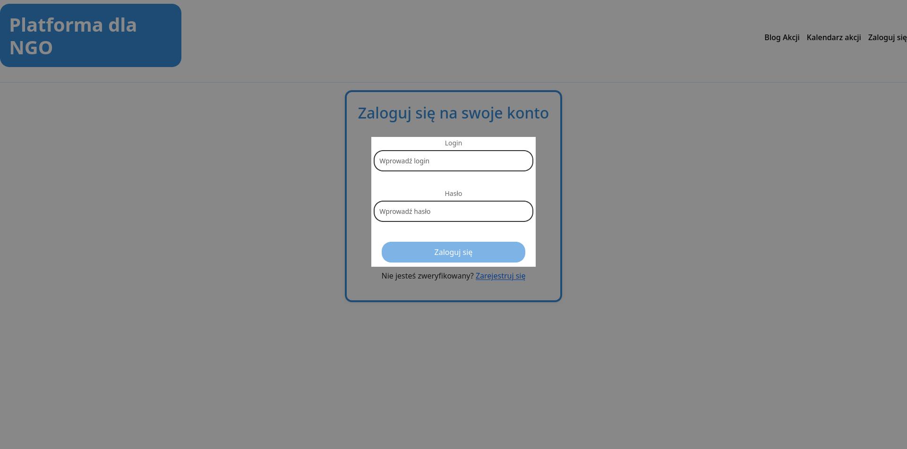
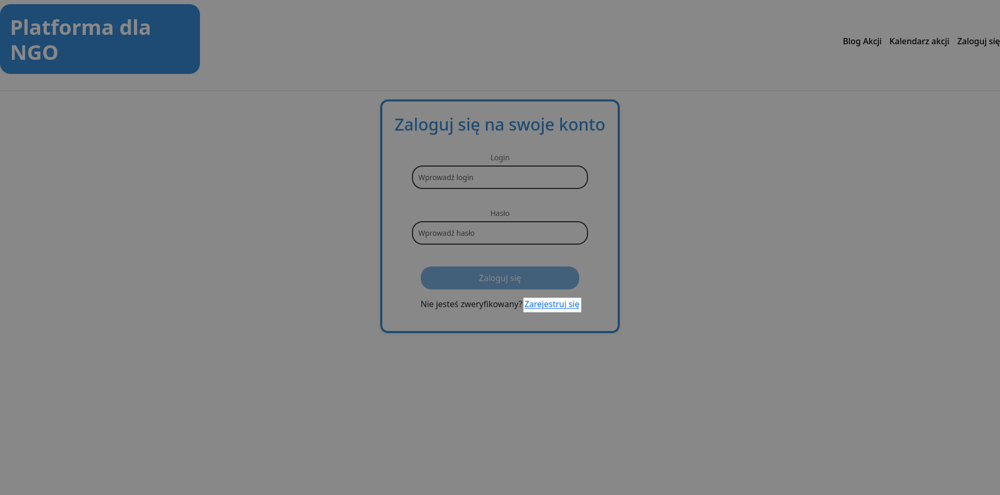

# 1.1 Logowanie
## Formularz logowania
Do zalogowania się na swoje konto, wymagane jest podanie `Loginu` oraz `Hasła`. Przycisk `Zaloguj się` staje się aktywny, dopiero po wpisaniu danych w oba pola. Jeśli dane są poprawne, następuje przekierowanie na konto użytkownika. W przeciwnym wypadku wyświetlany jest alert o niepoprawności wprowadzonych danych.

## Przejście do rejestracji
Jeśli użytkownik nie posiada konta, pod formularzem znajduje się link prowadzący do strony rejestracji. Proces rejestracji został wyjaśniony szczegółowy w kolejnym punkcie **[1.2 Rejestracja](../1.2%20Rejestracja/README.md)**

### *Przejście na stronę logowania
Przejście na stronę logowania jest możliwe z paska nawigacyjnego, patrz **[1 Niezalogowany](../#pasek-nawigacyjny)**

<a title="1 Niezalogowany" href="../README.md"><b>Poprzednia strona</b></a> 
| 
<a title="1.2 Rejestracja" href="../1.2 Rejestracja/README.md"><b>Następna strona</b></a> 

<a title="Strona główna" href="../../../README.md"><b>Strona główna</b></a> 
 
<a title="Spis treści" href="../../README.md"><b>Spis treści</b></a> 

