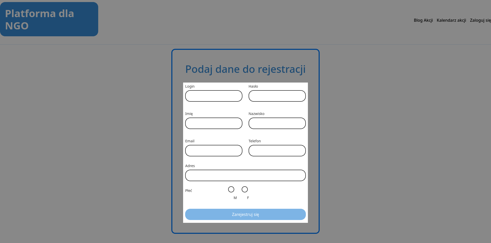

# 1.2 Rejestracja
## Formularz rejestracyjny
Wprowadzane dane do formularza są walidowane w odpowiedni sposób dla każdego pola:
 * `Login` - Wymagane przynajmniej **3** znaki
 * `Hasło` - Wymagane przynajmniej **6** znaków
 * `Imię` oraz `Nazwisko` - Wymagane pole bez ograniczeń
 * `Email` - Standardowa walidacja dla adresów mailowych
 * `Numer` - Wymagane dokładnie **9** cyfr
 * `Płeć`  - Wymagane pole

Po wypełnieniu każdego pola zgodnie z powyższym schematem, przycisk `Zarejestruj się` staje się aktywny i pozwala na założenie konta. 

### *Przejście na stronę rejestracji
Przejście na stronę rejestracji jest możliwe tylko ze strony logowania, patrz **[1.1 Logowanie](../1.1%20Logowanie/#przejscie-do-rejestracji)**

<a title="1.1 Logowanie" href="../1.1 Logowanie/README.md"><b>Poprzednia strona</b></a> 
| 
<a title="1.3 Wyświetlanie kalendarza" href="../1.3 Wyświetlanie kalendarza/README.md"><b>Następna strona</b></a> 

<a title="Strona główna" href="../../../README.md"><b>Strona główna</b></a> 
 
<a title="Spis treści" href="../../README.md"><b>Spis treści</b></a> 

