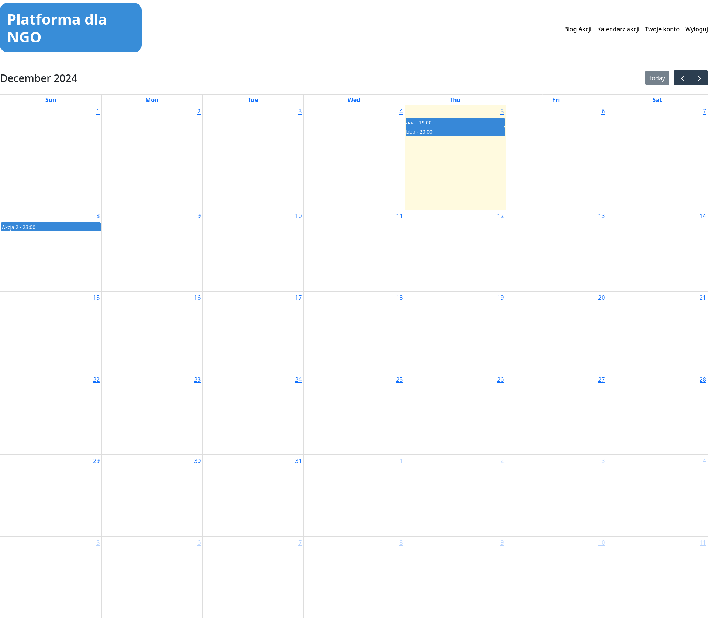
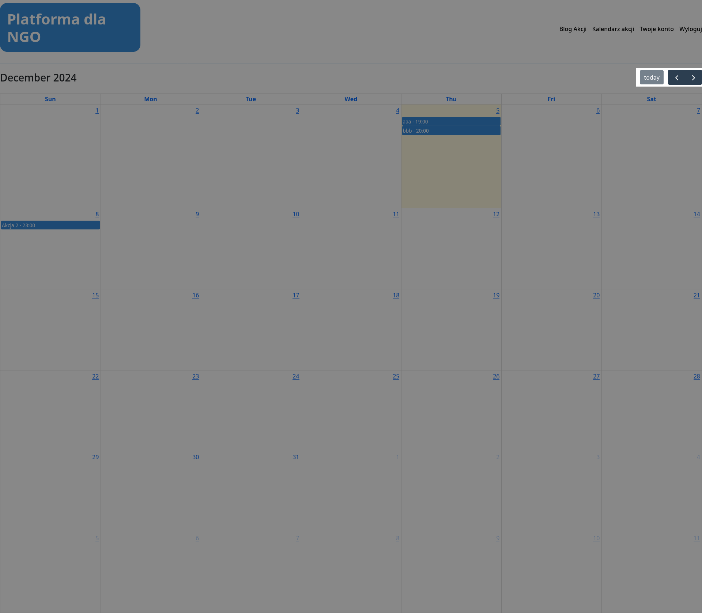
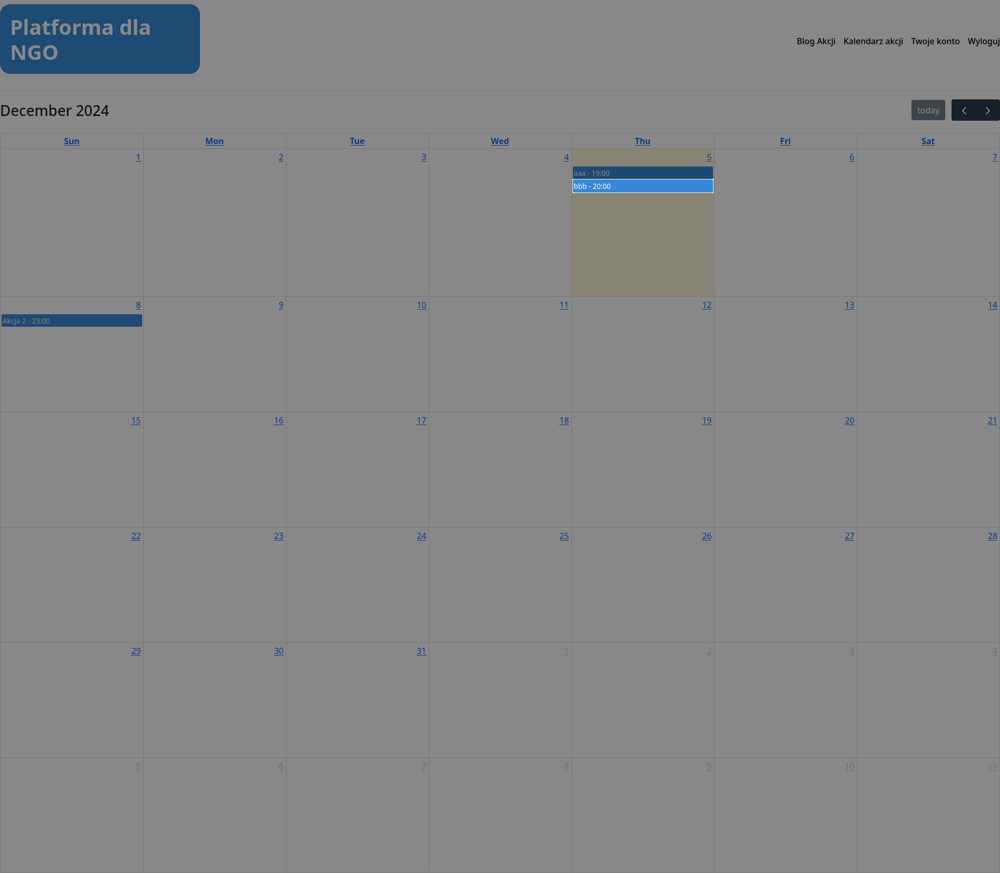

# 1.3 Wyświetlanie kalendarza
## Widok kalendarza
Kalendarz wyświetla wszystkie dostępne wydarzenia chronologicznie na przestrzeni wybranego miesiąca. W przypadku wielu wydarzeń jednego dnia, wydarzenia są posortowane zależnie od godziny w kolejności rosnącej. 

## Zmiana widoku kalendarza
Przy pomocy przycisków `<`, `>` i `today`, można zmienić aktualnie wyświetlany widok miesiąca.

## Przejście do szczegółów akcji
Naciśnięcie wybranego wydarzenia powoduje przejście do jego szczegółów.

<a title="1.2 Logowanie" href="../1.2 Rejestracja/README.md"><b>Poprzednia strona</b></a> 
| 
<a title="1.4 Wyświetlanie szczegółów akcji" href="../1.4 Wyświetlanie szczegółów akcji/README.md"><b>Następna strona</b></a> 

<a title="Strona główna" href="../../../README.md"><b>Strona główna</b></a> 
 
<a title="Spis treści" href="../../README.md"><b>Spis treści</b></a> 

