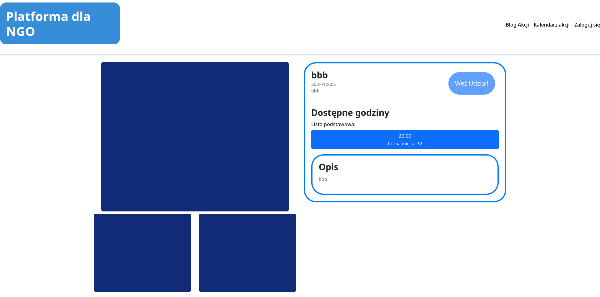
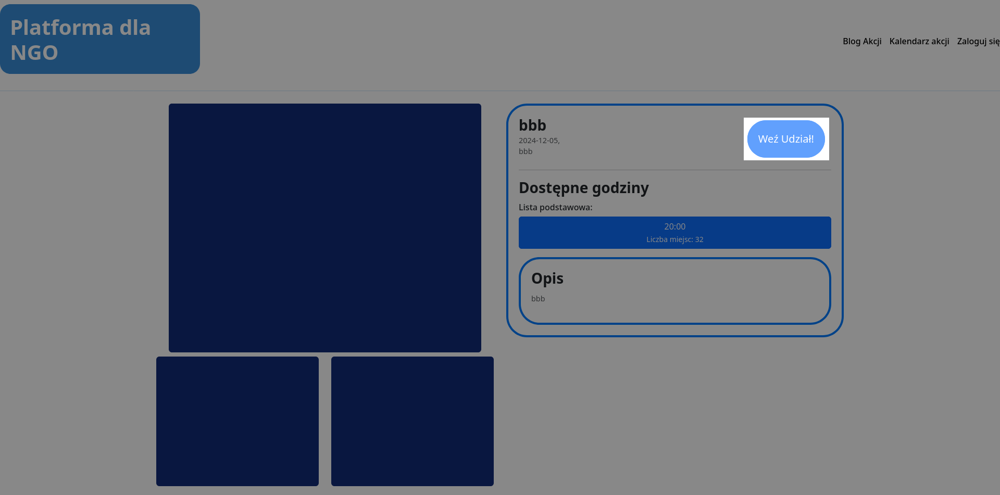

# 1.4 Wyświetlanie Szczegółów akcji
## Szczegóły wydarzenia
Użytkownicy mogą zobaczyć szczegóły wydarzenia, takie jak opis, data, godzina, lokalizacja oraz liczba dostępnych miejsc.

## Dostęp do wydarzenia
Niezalogowany użytkownik nie ma dostępu do uczestniczenia w wydarzeniach, dlatego przycisk zapisu na wydarzenie jest niekatywny.

<a title="1.3 Wyświetlanie kalendarza" href="../1.3 Wyświetlanie kalendarza/README.md"><b>Poprzednia strona</b></a> 
|  
<a title="2 Zalogowany" href="../../2 Zalogowany/README.md"><b>Następna strona</b></a>

<a title="Strona główna" href="../../../README.md"><b>Strona główna</b></a> 
 
<a title="Spis treści" href="../../README.md"><b>Spis treści</b></a> 

