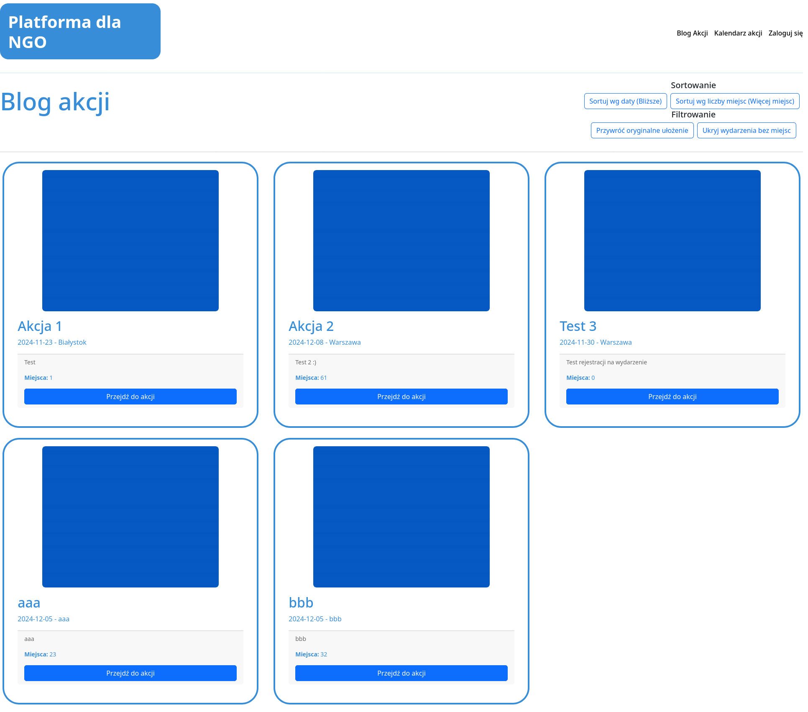
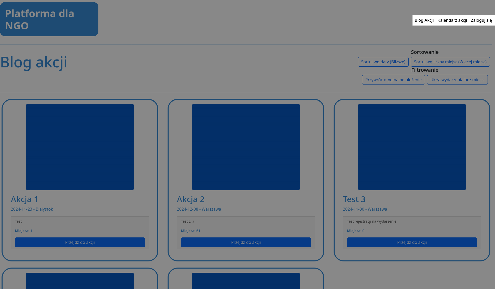
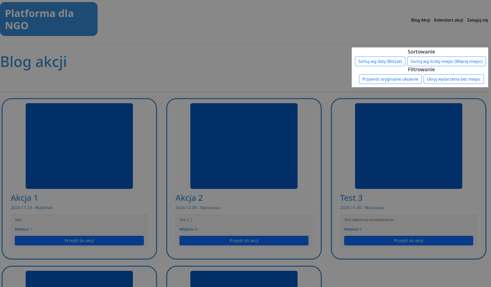

# 1 Niezalogowany

## Strona główna
Na stronie głównej aplikacji wyświetlane są wszystkie dostępne wydarzenia. Użytkownicy mogą zobaczyć podstawowe informacje wydarzenia, takie jak tytuł, krótki opis, data, lokalizacja oraz liczba dostępnych miejsc. Po wciśnięciu przycisku `Przejdź do akcji` następuje przekierowanie na stronę szczegółów wydarzenia, patrz **[1.4 Wyświetlanie szczegółów akcji](1.4%20Wyświetlanie%20szczegółów%20akcji/README.md)** 

## Pasek nawigacyjny
Na pasku nawigacyjnym niezalogowanego użytkownika znajdują się 3 pola:
 * `Blog Akcji` - Prowadzi na stronę główną aplikacji
 * `Kalendarz Akcji` - Prowadzi na stronę kalendarza, patrz **[1.3 Wyświetlanie kalendarza](1.3%20Wyświetlanie%20kalendarza/README.md)**
 * `Zaloguj się` - Prowadzi na stronę logowania, patrz **[1.1 Logowanie](1.1%20Logowanie/README.md)**

## Filtrowanie/Sortowanie wydarzeń
Wyświetlane wydarzenia można filtrować i sortować przy pomocy przycisków:
 * `Sortuj wg daty` - Przełącza sortowanie według daty między sortowaniem rosnąco a malejąco
 * `Sortuj wg liczby miejsc` - Przełącza sortowanie według liczby miejsc między sortowaniem rosnąco a malejąco
 * `Ukryj wydarzenia bez miejsc` - Ukrywa wydarzenia w których nie ma dostępnych miejsc i do których nie można się zapisać
 * `Przywróć oryginalne ułożenie` - Resetuje sortowanie oraz filtry

 
<a title="1.1 Logowanie" href="1.1 Logowanie/README.md"><b>Następna strona</b></a> 

<a title="Strona główna" href="../../README.md"><b>Strona główna</b></a> 
 
<a title="Spis treści" href="../README.md"><b>Spis treści</b></a> 

