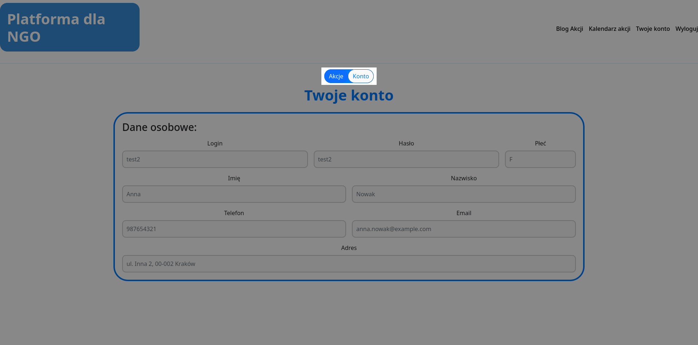
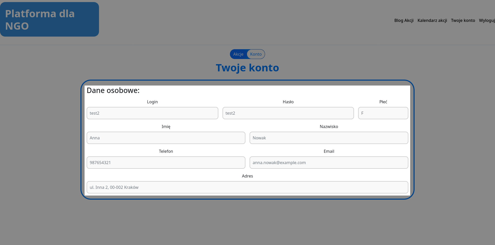
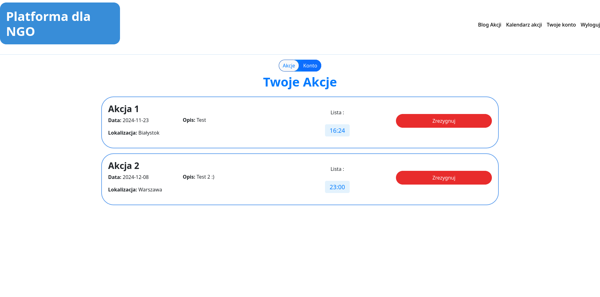
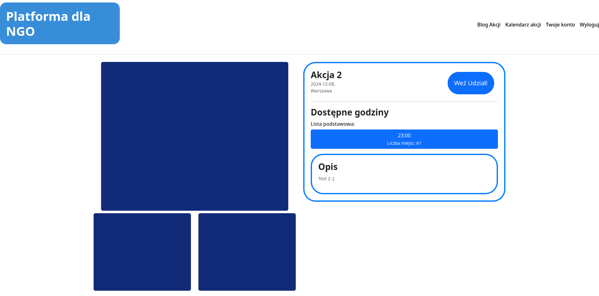

# 2.1 Użytkownik
## Konto użytkownika
Konto użytkownika składa się z dwóch widoków, widoku danych osobowych oraz widoku akcji użytkownika.
### Przełączanie widoku
Przełączenie na inny widok następuje po wciścięciu jednej z opcji `Akcje` lub `Konto`. Aktywny widok podświetlany jest na biało.

### Dane osobowe
Widok konta przestawia zbiór wszystkich danych osobowych podawanych podczas rejestracji użytkownika

### Akcje użytkownika
Widok akcji wyświetla wszystkie wydarzenia na które użytkownik jest zapisany. Wydarzenie składa się z podstawowych informacji, identycznych do tych wyświetlanych na stronie głównej, patrz **[1 Niezalogowany](../../1%20Niezalogowany/README.md)**, oraz przycisku `Zrezygnuj`, po którego wciśnięciu, użytkownik zostaje usunięty z akcji, a sama akcja zwiększa liczbę dostępnych miejsc.

## Wyświetlanie szczegółów akcji
Strona szczegółów wydarzenia, dla zalogowanego użytkownika, wygląda tak samo jak w przypadku niezalogowanego, patrz **[1.4 Wyświetlanie szczegółów akcji](../../1%20Niezalogowany/1.4%20Wyświetlanie%20szczegółów%20akcji/README.md)**, z wyjątkiem przycisku do zapisu. W tym przypadku, jeśli liczba miejsc jest większa od 0, przycisk jest aktywny i daje możliwość zapisu na wydarzenie. Po zapisie liczba miejsc zmniejsza się o jedno.

<a title="2 Zalogowany" href="../README.md"><b>Poprzednia strona</b></a> 
| 
<a title="2.2 Administrator" href="../2.2 Administrator/README.md"><b>Następna strona</b></a> 

<a title="Strona główna" href="../../../README.md"><b>Strona główna</b></a> 
 
<a title="Spis treści" href="../../README.md"><b>Spis treści</b></a> 

