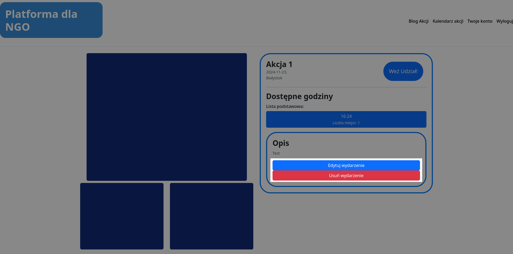

# 2.2.1 Wyświetlanie szczegółów akcji
## Widok szczegółów
Widok szczegółów akcji dla zalogowanego administratora zostaje rozszerzony, względem widoku zalogowanego użytkownika, patrz **[2.1 Użytkownik](../../2.1%20Użytkownik/README.md)**, o dwie dodatkowe funkcje:
 * `Edytuj wydarzenie` - Przechodzi na stronę edycji akcji, patrz **[2.2.3 Edycja akcji](../2.2.3%20Edycja%20akcji/README.md)**
 * `Usuń wydarzenie` - Usuwa całkowicie wydarzenie

<a title="2.2 Administrator" href="../2.2 Administrator/README.md"><b>Poprzednia strona</b></a> 
| 
<a title="2.2.2 Dodawanie nowej akcji" href="../2.2.2 Dodawanie nowej akcji/README.md"><b>Następna strona</b></a> 

<a title="Strona główna" href="../../../../README.md"><b>Strona główna</b></a> 
 
<a title="Spis treści" href="../../../README.md"><b>Spis treści</b></a> 

