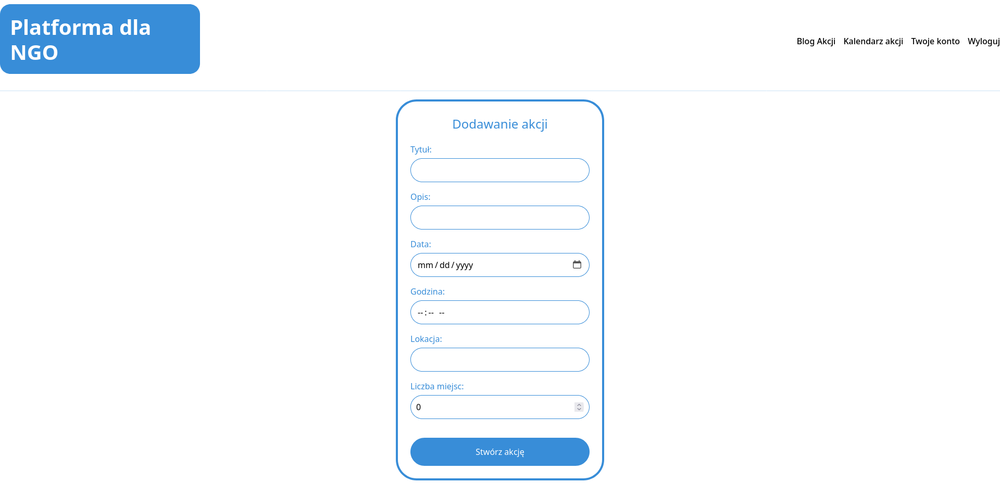

# 2.2.2 Dodawanie nowej akcji
## Formularz tworzenia akcji
Administrator definiuje szczegóły nowej akcji wypełniając formularz, a następnie zatwierdzając wpidane dane przyciskiem `Stwórz akcję`. Nowo stworzona akcja jest od razu dostępna dla wszystkich użytkowników.

### *Przejście na stronę dodawania nowej akcji
Przejście na stronę dodawania nowej akcji jest możliwe z poziomu konta administratora, patrz **[2.2 Administrator](../README.md)**

<a title="2.2.1 Wyświetlanie szczegółów akcji" href="../2.2.1 Wyświetlanie szczegółów akcji/README.md"><b>Poprzednia strona</b></a> 
| 
<a title="2.2.3 Edycja akcji" href="../2.2.3 Edycja akcji/README.md"><b>Następna strona</b></a> 

<a title="Strona główna" href="../../../../README.md"><b>Strona główna</b></a> 
 
<a title="Spis treści" href="../../../README.md"><b>Spis treści</b></a> 

