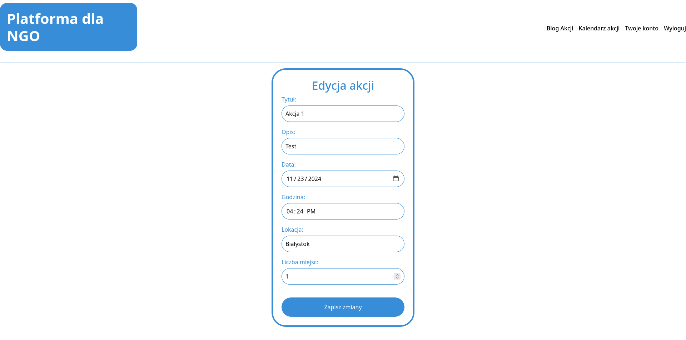

# 2.2.3 Edycja akcji
## Formularz edycji akcji
Administrator dostaje wypełniony formularz danymi akcji. Po wprowadzeniu zmian zatwierdza je przyciskiem `Zapisz zmiany`, a akcja zostaje zaktualizowana o zmienione dane.

### *Przejście na stronę edycji akcji
Przejście na stronę dodawania nowej akcji jest możliwe z poziomu konta administratora, patrz **[2.2 Administrator](../README.md)**, lub ze strony szczegółów akcji, patrz **[2.2.1 Wyświetlanie szczegółów akcji](../2.2.1%20Wyświetlanie%20szczegółów%20akcji/README.md)**

<a title="2.2.2 Dodawanie nowej akcji" href="../2.2.2 Dodawanie nowej akcji/README.md"><b>Poprzednia strona</b></a> 
| 
<a title="2.2.4 Wyświetlanie uczestników akcji" href="../2.2.4 Wyświetlanie uczestników akcji/README.md"><b>Następna strona</b></a> 

<a title="Strona główna" href="../../../../README.md"><b>Strona główna</b></a> 
 
<a title="Spis treści" href="../../../README.md"><b>Spis treści</b></a> 

