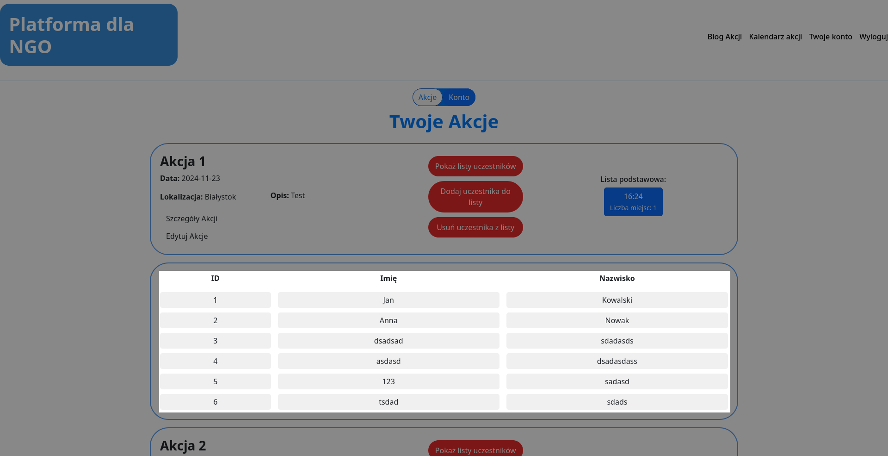

# 2.2.4 Wyświetlanie uczestników akcji
## Lista uczestników
Rozwinięta lista wyświetla `ID`, `Imię` i `Nazwisko` wszystkich użytkowników zapisanych na wybrane wydarzenie.

<a title="2.2.3 Edycja akcji" href="../2.2.3 Edycja akcji/README.md"><b>Poprzednia strona</b></a> 
| 
<a title="2.2.5 Dodawanie uczestnika do akcji" href="../2.2.5 Dodawanie uczestnika do akcji/README.md"><b>Następna strona</b></a> 

<a title="Strona główna" href="../../../../README.md"><b>Strona główna</b></a> 
 
<a title="Spis treści" href="../../../README.md"><b>Spis treści</b></a> 

