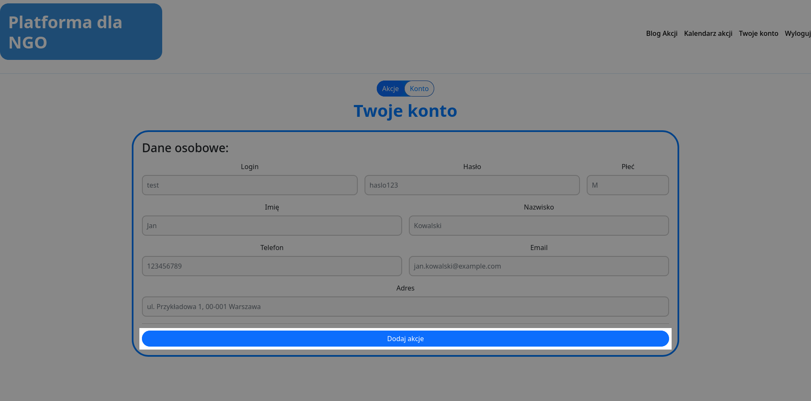
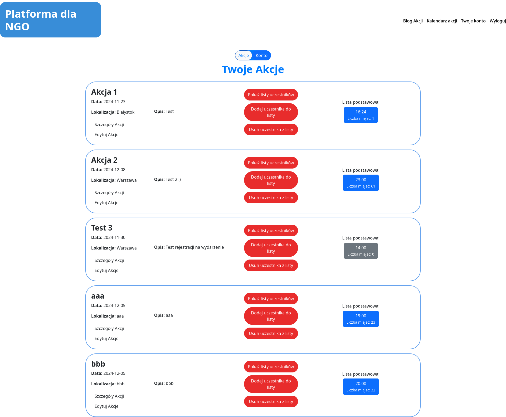
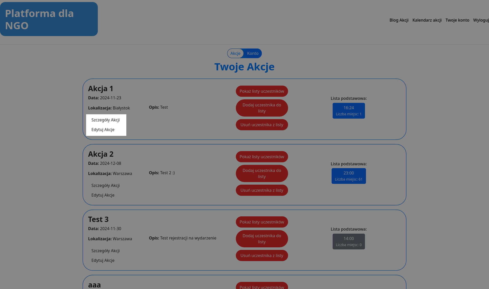
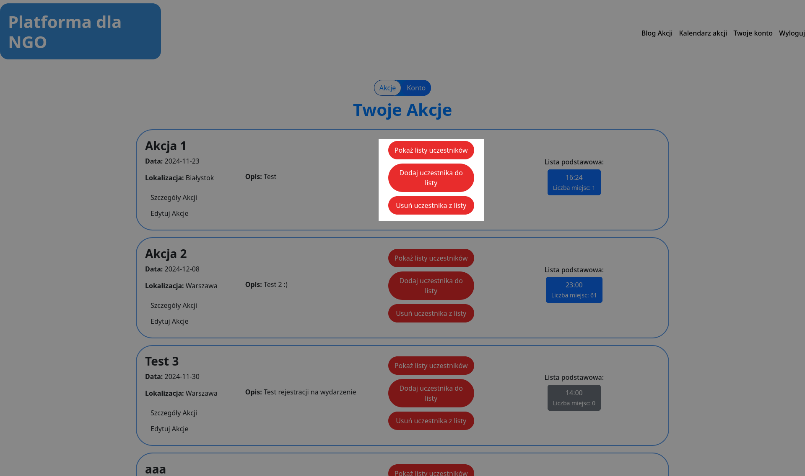

# 2.2 Administrator
## Konto administratora
Konto administratora, tak jak konto użytkownika, również składa się z dwóch widoków, konta oraz akcji.
### Widok konta
Widok konta administratora został wyposażony dodatkowo o przycisk dodawania akcji, względem widoku zwykłego użytkownika. Poza tym elementem, widok pozostaje taki sam, patrz **[2.1 Użytkownik](../2.1%20Użytkownik/README.md)**. Przycisk dodawania akcji przekierowuje administratora na stronę dodawania nowej akcji, patrz **[2.2.2 Dodawanie nowej akcji](2.2.2%20Dodawanie%20nowej%20akcji/README.md)**.

### Widok akcji
W widoku akcji administrator ma dostęp do wszystkich stworzonych wydarzeń. Każde wydarzenie składa się z podstawowych informacji oraz przycisków zarządzajacych akcją.

### Wyświetlanie szczegółów/Edycja akcji
Przyciski `Szczegóły Akcji` oraz `Edytuj Akcje`, przekierowują odpowiednio do szczegółów akcji, patrz **[2.2.1 Wyświetlanie szczegółów akcji](2.2.1%20Wyświetlanie%20szczegółów%20akcji/README.md)**, oraz do edycji akcji, patrz **[2.2.3 Edycja akcji](2.2.3%20Edycja%20akcji/README.md)**.

### Zarządzanie użytkownikami zapisanymi na wydarzenie
Administrator ma dostęp do listy uczestników biorących udział w konkretnym wydarzeniu. Do zarządzania listą są trzy główne przyciski:
 * `Pokaż listy uczestników` - Wyświetla całą listę użytkowników zapisanych na wydarzenie, patrz **[2.2.4 Wyświetlanie uczestników akcji](2.2.4%20Wyświetlanie%20uczestników%20akcji/README.md)**
 * `Dodaj uczestnika do akcji` - Wyświetla pole do wyszukiwania i dodawania użytkowników do akcji, z puli wszystkich zarejestrowanych użytkowników, patrz **[2.2.5 Dodawanie uczestnika do akcji](2.2.5%20Dodawanie%20uczestnika%20do%20akcji/README.md)**
 * `Usuń uczestnika z listy` - Wyświetla pole do wyszukiwania i usuwania użytkowników z akcji, z puli użytkowników zapisanych na daną akcje, patrz **[2.2.6 Usuwanie uczestnika z akcji](2.2.6%20Usuwanie%20uczestnika%20z%20akcji/README.md)**

<a title="2.1 Użytkownik" href="../2.1 Użytkownik/README.md"><b>Poprzednia strona</b></a> 
| 
<a title="2.2.1 Wyświetlanie szczegółów akcji" href="2.2.1 Wyświetlanie szczegółów akcji/README.md"><b>Następna strona</b></a>

<a title="Strona główna" href="../../../README.md"><b>Strona główna</b></a> 
 
<a title="Spis treści" href="../../README.md"><b>Spis treści</b></a> 

