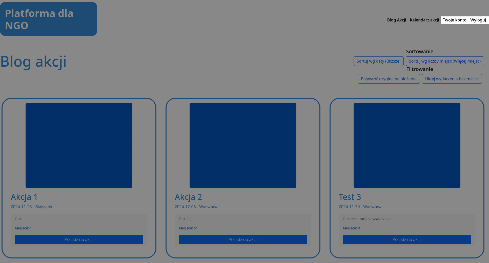

# 2 Zalogowany
## Strona główna
Strona główna dla zalogowanego użytkownika różni się jedynie paskiem nawigacyjnym względem strony widocznej dla użytkownika niezalogowanego. Szczegółowe informacje dostępne są w pierwszym rozdziale, patrz **[1 Niezalogowany](../1%20Niezalogowany/README.md)**.

## Pasek nawigacyjny
Dla zalogowanego użytkownika w pasku nawigacyjnym pojawia się dodatkowa opcja `Twoje konto` która przenosi użytkownika na jego stronę konta, patrz **[2.1 Użytkownik](2.1%20Użytkownik/README.md)**. Opcja `Zaloguj się` zamienia się w opcję `Wyloguj` która wylogowuje użytkownika.

<a title="1.4 Wyświetlanie szczegółów akcji" href="../1 Niezalogowany/1.4 Wyświetlanie szczegółów akcji/README.md"><b>Poprzednia strona</b></a> 
| 
<a title="2.1 Użytkownik" href="2.1 Użytkownik/README.md"><b>Następna strona</b></a> 

<a title="Strona główna" href="../../README.md"><b>Strona główna</b></a> 
 
<a title="Spis treści" href="../README.md"><b>Spis treści</b></a> 

